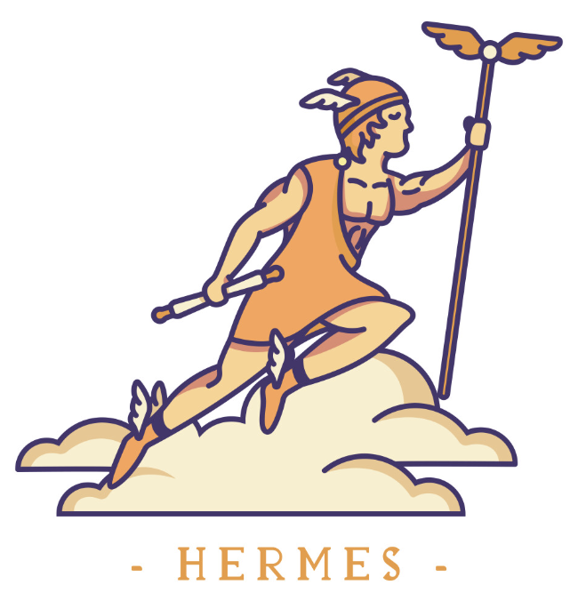

# Hermes

<p align="center">
    
</p>

Hermes is a simulator for a mobile robot, acting as a BDI agent, that navigates a custom maze through the use of a LiDAR sensor and various Bluetooth beacons placed at each intersection. 

## Description
Hermes has the ability to perform the following:
- Maintain a consistent distance with the wall.
- Navigate the maze with its many intersections and complete a full trip from point A to point B using its preloaded map of the beacon connections.
- Handle possible collisions and by pass obstacles through the use of its bumper sensor.

This robot is based on the [iRobot Create 3](https://edu.irobot.com/what-we-offer/create3) developed by the iRobot company.

In addition to that, Hermes uses the popular AgentSpeak language [Jason](https://jason-lang.github.io/) to implement the BDI architecture.

## Installation
1. Install the proper version of [ROS](https://docs.ros.org/en/foxy/Installation.html) on your device (I used ROS Foxy for mine)

2. Make sure to source your installation:
```
$ source /opt/ros/foxy/setup.bash
```

3. Create a ROS workspace for your system. Such as:
```
$ mkdir -p ~/hermes_ws/src
```

4. Install the appropriate version of [iRobot Create 3 Sim](https://github.com/iRobotEducation/create3_sim/tree/foxy).


5. Install the ROS dependencies:
```
$ cd ~/hermes_ws
$ rosdep install --from-path src -yi
```
6. Build all the ROS packages by doing:
```
$ colcon build --symlink-install
```

7. Source your installation by doing:
```
$ source ~/hermes_ws/install/local_setup.bash
```

## Running Hermes

First try to fire up the simulator by doing:
```
$ ros2 launch hermes_environment environment.launch.py
```

You should see the Gazebo and RViz windows pop up:
<p align="center">
    
</p>

In a separate window try controlling the robot by running a few ROS commands:

- To move the robot in a separate terminal try:
```
$ source ~/hermes_ws/install/local_setup.bash
$ ros2 topic pub -r 20 /cmd_vel geometry_msgs/msg/Twist "{linear: {x: 0.2, y: 0.0, z: 0.0}, angular: {x: 0.0, y: 0.0, z: 0.0}}"
```

- To dock the robot in a separate terminal try:
```
$ source ~/hermes_ws/install/local_setup.bash
$ ros2 action send_goal /dock irobot_create_msgs/action/DockServo "{}"
```

- To undock the robot in a separate terminal try:
```
$ source ~/hermes_ws/install/local_setup.bash
$ ros2 action send_goal /undock irobot_create_msgs/action/Undock "{}"
```

## Notes
- The inspiration for this project came from another similar project I worked on. Make sure to check out [Carleton Mail Delivery Robot](https://github.com/bardia-p/carleton-mail-delivery-robot)!
- The name Hermes is a nod to the previous major AgentSpeak projects namely, [Jason](https://github.com/jason-lang/jason) and [Peleus](https://github.com/meneguzzi/Peleus). I chose the name Hermes since the main purpose of this robot is to deliver mail from one place to another. 

## TO-DO
- Add beacons to the simulator
- Add custom map generation
- Add a simple Jason implementation for the robot
