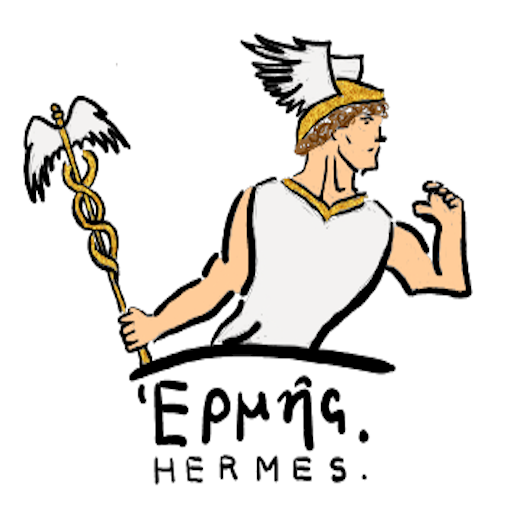
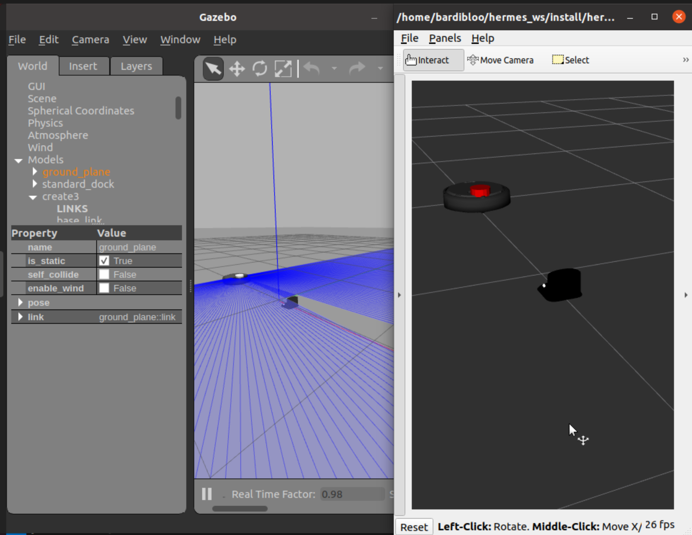

# Hermes

<p align="center">
    
    <br>
    <em>Logo designed by Daniel Pacada</em>
</p>

Hermes is a simulator for a mobile robot, acting as a BDI agent, that navigates a custom maze through the use of a LiDAR sensor and various Bluetooth beacons placed at each intersection. 

## Description
Hermes has the ability to perform the following:
- Maintain a consistent distance from the wall.
- Navigate the maze with its many intersections and complete a full trip from point A to point B using its preloaded map of the beacon connections.
- Handle possible collisions and by pass obstacles through the use of its bumper sensor.

This robot is based on the [iRobot Create 3](https://edu.irobot.com/what-we-offer/create3) developed by the iRobot company.

In addition to that, Hermes uses the popular AgentSpeak language [Jason](https://jason-lang.github.io/) to implement the BDI architecture.

## Installation
1. Install [ROS Foxy](https://docs.ros.org/en/foxy/Installation.html) on an Ubuntu 20.04 system

2. Make sure to source your installation:
```
$ source /opt/ros/foxy/setup.bash
```

3. Install ROS [Gazebo 11](https://classic.gazebosim.org/tutorials?tut=ros2_installing):
```
$ sudo apt install ros-foxy-gazebo-ros-pkgs
```

4. Install [RViz2](https://github.com/ros2/rviz):
```
$ sudo apt install ros-foxy-rviz2
```

5. Install all the required Python packages using:
```
$ pip install -r requirements.txt
```

6. Create a ROS workspace for your system. Such as:
```
$ mkdir -p ~/hermes_ws/src
$ cd ~/hermes_ws/src
```

7. Clone [hermes](https://github.com/bardia-p/hermes):
```
$ git clone git@github.com:bardia-p/hermes.git
```

8. Clone the appropriate ROS dependencies:
```
$ vcs import ~/hermes_ws/src/ < ~/hermes_ws/src/hermes/dependencies.repos
```

9. Install the ROS dependencies:
```
$ cd ~/hermes_ws
$ sudo rosdep init
$ rosdep update
$ rosdep install --from-path src -yi
```

10. Build all the ROS packages by doing:
```
$ colcon build --symlink-install
```

11. Source your installation by doing:
```
$ source ~/hermes_ws/install/local_setup.bash
```

**NOTE:** If at any point you face any issues with the installation process of these ROS dependencies, please refer to the README files of the appropriate repositories:
- [create3_sim](https://github.com/iRobotEducation/create3_sim/tree/foxy)
- [irobot_create_msgs](https://github.com/iRobotEducation/irobot_create_msgs)

## Running Hermes

First try to fire up the simulator by doing:
```
$ source ~/hermes_ws/install/local_setup.bash
$ ros2 launch hermes_environment environment.launch.py
```

You should see the Gazebo and RViz windows pop up:
<p align="center">
    
</p>

In a separate window try controlling the robot by running a few ROS commands:

- **Moving the robot:** in a separate terminal try:
```
$ source ~/hermes_ws/install/local_setup.bash
$ ros2 topic pub -r 20 /cmd_vel geometry_msgs/msg/Twist "{linear: {x: 0.2, y: 0.0, z: 0.0}, angular: {x: 0.0, y: 0.0, z: 0.0}}"
```

- **Docking the robot:** in a separate terminal try:
```
$ source ~/hermes_ws/install/local_setup.bash
$ ros2 action send_goal /dock irobot_create_msgs/action/DockServo "{}"
```

- **Undocking the robot:** in a separate terminal try:
```
$ source ~/hermes_ws/install/local_setup.bash
$ ros2 action send_goal /undock irobot_create_msgs/action/Undock "{}"
```

## Project Structure
- **hermes_create_description:** This package includes the Gazebo descriptions for the robotcs, sensors, and the dock station. It also includes the appropriate launch files for spawning these objects.
- **hermes_environment:** This package includes the implementation for the simulator environment with the various configs for loading the robot map.

## Notes
- The inspiration for this project came from another similar project I worked on. Make sure to check out [Carleton Mail Delivery Robot](https://github.com/bardia-p/carleton-mail-delivery-robot)!
- The name Hermes is a nod to the previous major AgentSpeak projects namely, [Jason](https://github.com/jason-lang/jason) and [Peleus](https://github.com/meneguzzi/Peleus). I chose the name Hermes since the main purpose of this robot is to deliver mail from one place to another. 

## Acknowledgements
- [iRobot's Create 3 Simulator](https://github.com/iRobotEducation/create3_sim/tree/foxy) for the main robot simulator.
- [Jason](https://github.com/jason-lang/jason) for the AgentSpeak implementation of the project.
- [savi_ROS_BDI](https://github.com/NMAI-lab/savi_ros_bdi.git) for ROS and Jason's integration.
- [ros2_java](https://github.com/ros2-java/ros2_java.git) for the ros2 and Jason integration (at commit 610299c65a9b4165ea8cde6bb2cf5f4602a8819c)
- [Peleus](https://github.com/meneguzzi/Peleus) for connecting Jason to various planners.
- [ENHSP](https://gitlab.com/enricos83/ENHSP-Public.git) for creating the robot plans.

## TO-DO
- Add custom map generation
- Add a simple Jason implementation for the robot
- Connect Peleus the ENHSP planner
- Convert the project to a Docker container
