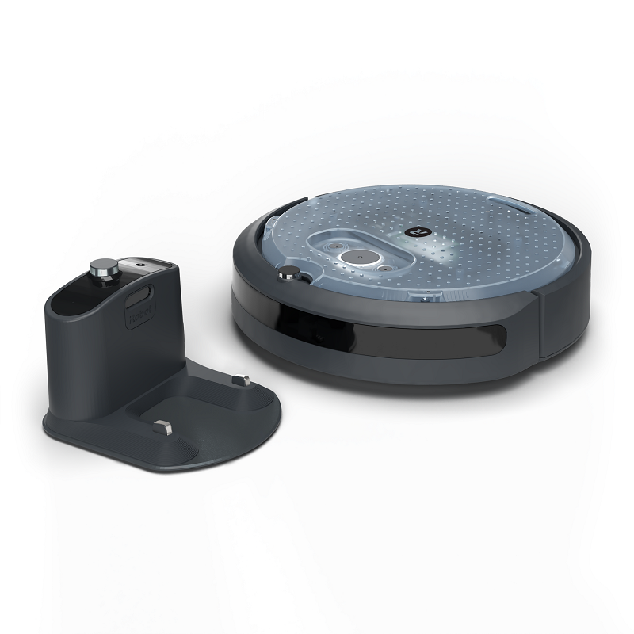
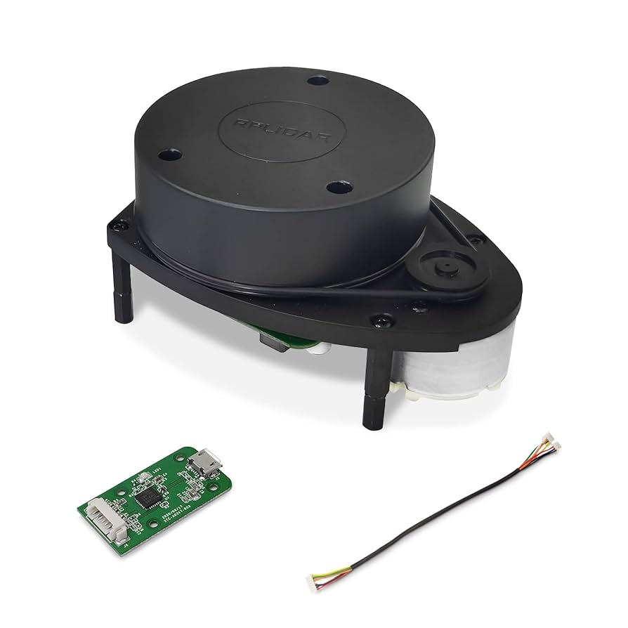
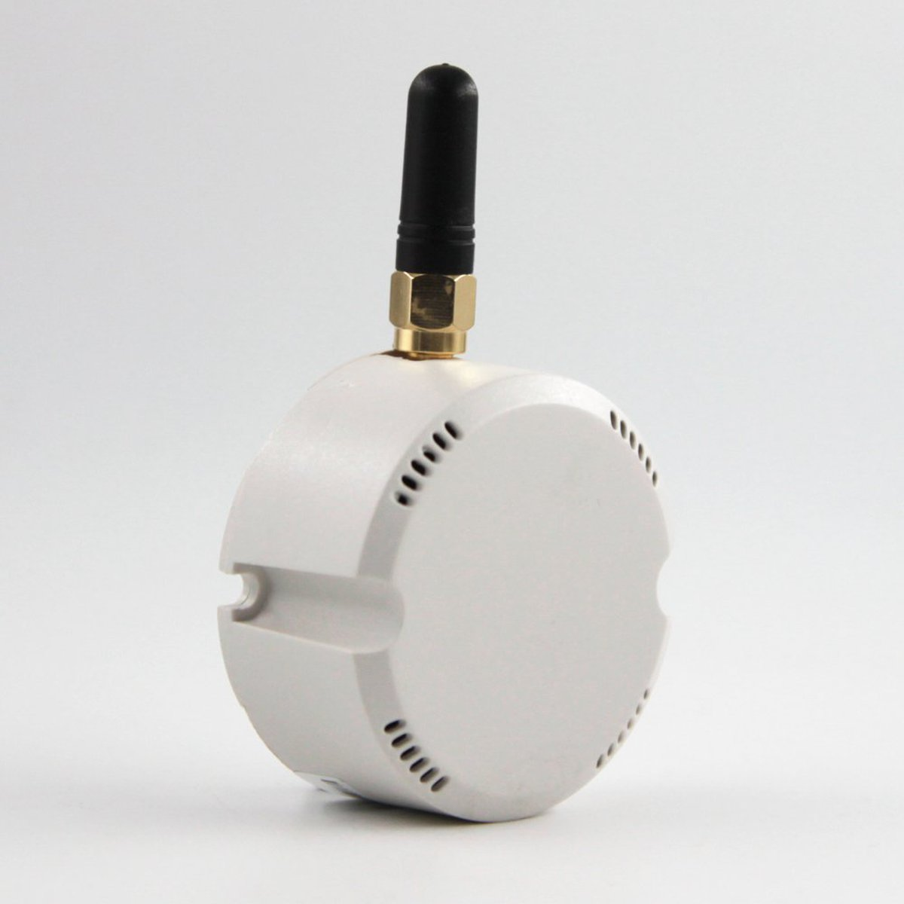
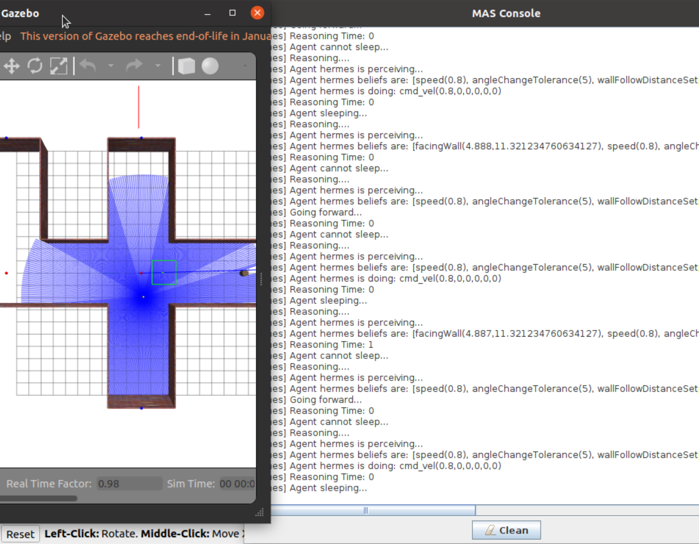

# Hermes

<p align="center">
    
    <br>
    <em>Logo designed by Daniel Pacada</em>
</p>

Hermes is a mobile robot, acting as a BDI agent, that navigates a custom maze through the use of a LiDAR sensor and the various Bluetooth beacons placed along its way. The goal of Hermes is to showcase a realistic application of AgentSpeak and Jason BDI. 

## Description
Hermes has the ability to perform the following:
- Maintain a consistent distance with the wall.
- Navigate the maze with its many intersections and complete a full trip from point A to point B using its preloaded map of the beacon connections.
- Handle possible collisions and bypass obstacles through the use of its bumper sensor.

This robot is based on the [iRobot Create 3](https://edu.irobot.com/what-we-offer/create3) developed by the iRobot company.

In addition to that, Hermes uses the popular AgentSpeak language [Jason](https://jason-lang.github.io/) to implement the BDI architecture.

Hermes can be run in two modes:
- **Simulator mode (either locally or within Docker):** This option utilizes ROS Gazebo to allow the user to fully simulate a maze environment with the iRobot Create 3 robot in it.
- **Robot mode (requires the physical robot):** This option allows the user to run the Jason BDI logic directly on the physical robot.

## Installation

### Docker Installation

Build a local container using:
```console
$ docker build --build-arg ARCH=$(dpkg --print-architecture) -t hermes . 
```

### Local Installation

1. Install [ROS Foxy](https://docs.ros.org/en/foxy/Installation.html) on an Ubuntu 20.04 system

2. Make sure to source your installation:
```console
$ source /opt/ros/foxy/setup.bash
```

3. Install the Open-JDK 21:
```console
$ sudo apt install -y openjdk-21-jdk openjdk-21-jre
$ export JAVA_HOME=/usr/lib/jvm/java-21-openjdk-$(dpkg --print-architecture)
$ export PATH=$JAVA_HOME/bin:$PATH
```

4. Install gradle 8:
```console
$ sudo mkdir /opt/gradle && cd /opt/gradle
$ sudo curl -L https://services.gradle.org/distributions/gradle-8.14.2-bin.zip -o gradle.zip
$ sudo unzip gradle.zip
$ export GRADLE_HOME=/opt/gradle/gradle-8.14.2
$ export PATH=$GRADLE_HOME/bin:$PATH
```

5. Install ROS [Gazebo 11](https://classic.gazebosim.org/tutorials?tut=ros2_installing):
```console
$ sudo apt install ros-foxy-gazebo-ros-pkgs
```

6. Install [RViz2](https://github.com/ros2/rviz):
```console
$ sudo apt install ros-foxy-rviz2
```

7. Create a ROS workspace for your system. Such as:
```console
$ mkdir -p ~/hermes_ws/src
$ cd ~/hermes_ws/src
```

8. Clone [hermes](https://github.com/bardia-p/hermes):
```console
$ git clone git@github.com:bardia-p/hermes.git
```

9. Install all the required Python packages using:
```console
$ cd ~/hermes_ws/src/hermes
$ pip install -r requirements.txt
```

10. Clone the appropriate ROS dependencies:
```console
$ vcs import ~/hermes_ws/src/ < ~/hermes_ws/src/hermes/simulator_dependencies.repos
```

11. Install the ROS dependencies:
```console
$ cd ~/hermes_ws
$ sudo rosdep init
$ rosdep update
$ rosdep install --from-paths src -yi --skip-keys "ament_tools"
```

12. Install the ROS2 ament Java gradle plugin:
```console
$ cd src/ros2-java/ament_gradle_plugin
$ gradle publishToMavenLocal
```

13. Build all the ROS packages by doing:
```console
$ cd ~/hermes_ws
$ colcon build --symlink-install

# Fix the classpath for the hermes_agent package (this is a bug in ament_gradle_plugin)
$ sed -i "/^CLASSPATH=/d" ./install/hermes_agent/lib/hermes_agent/hermes_agent
```

14. Source your installation by doing:
```console
$ source ~/hermes_ws/install/local_setup.bash
```

### Physical Robot Installation (on a Raspberry Pi)

#### Required Equipment

<table>
  <tr>
     <td>iRobot Create 3 and Dock Station</td>
     <td>RPLiDAR A1</td>
     <td>AprilBeacon N04</td>
  </tr>
  <tr>
    <td></td>
    <td></td>
    <td></td>
  </tr>
 </table>

#### iRobot Create 3 Hardware Setup

1. Unscrew the faceplate of the Create 3 and ensure that the USB/BLE toggle on the adapter board is in the USB position. Screw the faceplate back into position.

2. Screw the [3D printed Raspberry Pi 4B mount](miscellaneous/CAD_Models/C3-RPi-Mount.stl) in the cargo bay and attach the Pi.

3. Connect a USB-C cable between the USB-C port in the robot's cargo bay and the Raspberry Pi 4B's USB power input.

4. Connect a USB-to-micro USB cable to the Pi and a micro USB-to-serial converter. Route the cable through the cable passthrough hole to the top of the robot.

5. Screw the [3D printed LiDAR mount](miscellaneous/CAD_Models/C3-RPLidar-A1-Mount.stl) and standoffs into the faceplate and attach the LiDAR.

6. Using the LiDAR serial cable, connect the LiDAR pins to the USB-to-serial converter.

Here is what the final robot setup looks like:
<p align="center">
    
</p>

#### iRobot Create 3 Software Setup

1. Download the latest version of the Create 3 [firmware](https://edu.irobot.com/create3-update)

2. Power on the robot by plugging it into the charging dock.

3. Press and hold both side buttons until the light ring turns blue.

4. Connect to the Create-[xxx] Wi-Fi network on your device.

5. Navigate to 192.168.10.1 to access the Create 3 web interface.

6. Navigate to the Update tab and follow the steps to upload the downloaded firmware.

7. Wait until the robot chimes and then navigate to the `Application -> Configuration tab`.

8. Ensure the RMW_IMPLEMENTATION dropdown is set to rmw_cyclonedds_cpp.

9. If you changed the RMW implementation, restart the application.

10. Navigate to the `Beta Features -> NTP sources` tab and add `server 192.168.186.3 iburst` so the robot can receive NTP info from the Raspberry Pi.

11. Reboot the robot and disconnect from the Wi-Fi network.

#### Raspberry Pi Setup

1. Install Ubuntu 22.04 on your Raspberry Pi.

2. Install [ROS Humble](https://docs.ros.org/en/humble/Installation.html) the Pi.

3. Setup an NTP server on the Raspberry Pi by following this [guide](https://iroboteducation.github.io/create3_docs/setup/compute-ntp/) (steps 6 and 7 were already done in the previous section).

4. Run `timedatectl` and check if `System clock synchronized` has the value `yes`. 
  - If it does, move on the locale configuration.
  - If not:
    * Run `sudo nano /etc/systemd/timesyncd.conf`.
    * Add `NTP=ntp.ubuntu.com` and `FallbackNTP=0.us.pool.ntp.org` if not already configured.
    * Run `systemctl restart systemd-timesyncd.service`.

5. Make sure to source your installation:
```console
$ source /opt/ros/humble/setup.bash
```

6. Ensure the correct RMW implementation is chosen by doing `RMW_IMPLEMENTATION=rmw_cyclonedds_cpp`.

7. Install the Open-JDK 21:
```console
$ sudo apt install -y openjdk-21-jdk openjdk-21-jre
$ export JAVA_HOME=/usr/lib/jvm/java-21-openjdk-$(dpkg --print-architecture)
$ export PATH=$JAVA_HOME/bin:$PATH
```

8. Install gradle 8:
```console
$ sudo mkdir /opt/gradle && cd /opt/gradle
$ sudo curl -L https://services.gradle.org/distributions/gradle-8.14.2-bin.zip -o gradle.zip
$ sudo unzip gradle.zip
$ export GRADLE_HOME=/opt/gradle/gradle-8.14.2
$ export PATH=$GRADLE_HOME/bin:$PATH
```

9. Create a ROS workspace for your system. Such as:
```console
$ mkdir -p ~/hermes_ws/src
$ cd ~/hermes_ws/src
```

10. Clone [hermes](https://github.com/bardia-p/hermes):
```console
$ git clone git@github.com:bardia-p/hermes.git
```

11. Install all the required Python packages using:
```console
$ cd ~/hermes_ws/src/hermes
$ pip install -r requirements.txt
```

12. Clone the appropriate ROS dependencies:
```console
$ vcs import ~/hermes_ws/src/ < ~/hermes_ws/src/hermes/robot_dependencies.repos
```

13. Install the ROS dependencies:
```console
$ cd ~/hermes_ws
$ sudo rosdep init
$ rosdep update
$ rosdep install --from-paths src -yi --skip-keys "ament_tools"
```

14. Install the ROS2 ament Java gradle plugin:
```console
$ cd src/ros2-java/ament_gradle_plugin
$ gradle publishToMavenLocal
```

15. Give the BluePy library permission to run without root
```console
# Get /path/to/bluepy-helper (you can maybe use:)
$ find ~/.local -name bluepy-helper

$ sudo setcap 'cap_net_raw,cap_net_admin+eip' /path/to/bluepy-helper
$ sudo usermod -aG bluetooth $USER
```

16. Build all the ROS packages by doing:
```console
$ cd ~/hermes_ws
$ colcon build --symlink-install

# Fix the classpath for the hermes_agent package (this is a bug in ament_gradle_plugin)
$ sed -i "/^CLASSPATH=/d" ./install/hermes_agent/lib/hermes_agent/hermes_agent
```

17. Source your installation by doing:
```console
$ source ~/hermes_ws/install/local_setup.bash
```

### Installation Notes

**NOTE:** If at any point you face any issues with the installation process of these ROS dependencies, please refer to the README files of the appropriate repositories:
- [create3_sim](https://github.com/iRobotEducation/create3_sim/)
- [ros2_java](https://github.com/ros2-java/ros2_java)

**NOTE:** To ensure compatability with the current ROS and Java versions, the following repositories have been customized:
- [ament_gradle_plugin](https://github.com/NMAI-lab/ament_gradle_plugin)
- [ros2_java](https://github.com/NMAI-lab/ros2_java)

**NOTE:** `ament_gradle_plugin` seems to still be in its Beta stage. Consecutive calls to `colcon build --symlink-install` can cause discrepencies in your `Java CLASSPATH`, resulting in your libraries getting lost at runtime. If you notice issues of that sort do the following (running these commands during every colcon install is strongly recommended):
```console
$ cd ~/hermes_ws
$ rm -rf build/hermes_agent install/hermes_agent
$ colcon build --symlink-install
$ sed -i "/^CLASSPATH=/d" ./install/hermes_agent/lib/hermes_agent/hermes_agent
```

Make sure to run `$ source ~/hermes_ws/install/local_setup.bash` before running Hermes again.

## Running Hermes

### Running the Simulator

#### Running the simulator in Docker

Make sure you have built the `hermes-ros2` docker container.

- Connect `xhost` to docker:
```console
$ xhost +local:docker
```

- Start the docker container:
```console
$ docker run -it \
  --env DISPLAY=$DISPLAY \
  --env QT_X11_NO_MITSHM=1 \
  --volume /tmp/.X11-unix:/tmp/.X11-unix:rw \
  hermes
```

- Launch the simulator in the container:
```console
$ ros2 launch hermes_simulator simulator.launch.py start:=B3 end:=B1 display_mas:=true
```

#### Running the simulator locally 

First try to fire up the simulator by doing:
```console
$ source ~/hermes_ws/install/local_setup.bash
$ ros2 launch hermes_simulator simulator.launch.py start:=B3 end:=B1 display_mas:=true
```

You should see the Gazebo and RViz windows pop up:
<p align="center">
    
</p>

#### Cleaning up after the simulator

A cleanup script has been included to ensure a proper cleanup of the shared memory and any leftover processes. If you run into any issues with the simulator, simply run:
```console
$ ./perform_cleanup.sh
``` 

### Running Hermes on the physical robot

1. Plug in the LiDAR sensor to the the Raspberry Pi through USB

2. Turn on the iRobot Create 3

3. Have your Bluetooth Beacons ready and make sure their MAC addresses and orientation match [beacons_list](hermes_environment/worlds/beacons_list.yaml)

4. Make sure the map matches [map](hermes_environment/worlds/map.json) (you can ignore the obstacles and distance fields)

5. SSH the Raspberry Pi on the robot

6. Make sure the robot is fully powered on and linked to ROS by doing a quick check:

```console
$ ros2 topic list

/battery_state
/cliff_intensity
/cmd_audio
/cmd_lightring
/cmd_vel
/dock_status
/hazard_detection
/imu
/interface_buttons
/ir_intensity
/ir_opcode
/kidnap_status
/mobility_monitor/transition_event
/mouse
/odom
/parameter_events
/robot_state/transition_event
/rosout
/slip_status
/static_transform/transition_event
/stop_status
/tf
/tf_static
/wheel_status
/wheel_ticks
/wheel_vels
```

7. Start up Hermes
```console
$ source ~/hermes_ws/install/local_setup.bash
$ ros2 launch hermes_simulator robot.launch.py end:=B1
```

## Project Structure
- **hermes_create_description:** This package includes the Gazebo descriptions for the robotcs, sensors, and the dock station. It also includes the appropriate launch files for spawning these objects.
- **hermes_environment:** This package includes the implementation of the simulation environment with the various configs for loading the robot map.
- **hermes_agent:** This package includes the implementation of the agent which is in charge of parsing the agent brain files.
- **hermes_simulator:** This package includes the implementation of the simulator with the various sensors for interpreting the environment. This package invokes the environment, the agent, and the sensors.

## Notes
- The inspiration for this project came from another similar project I worked on. Make sure to check out [Carleton Mail Delivery Robot](https://github.com/bardia-p/carleton-mail-delivery-robot)!
- The name Hermes is a nod to the previous major AgentSpeak projects namely, [Jason](https://github.com/jason-lang/jason) and [Peleus](https://github.com/meneguzzi/Peleus). I chose the name Hermes since the main purpose of this robot is to deliver mail from one place to another. 

## Acknowledgements
- [iRobot's Create 3 Simulator](https://github.com/iRobotEducation/create3_sim) for the main robot simulator.
- [ros2_java](https://github.com/ros2-java/ros2_java) to integrate ROS2 with the Java agent implementations.
- [Jason](https://github.com/jason-lang/jason) an AgentSpeak interpreter for the agent definitions.
- [Peleus](https://github.com/meneguzzi/Peleus) for connecting Jason to various planners **(TODO)**.
- [JPDDLPLUS](https://github.com/hstairs/jpddlplus) for generating PDDL plans using its builtin ENHSP planner **(TODO)**.

## TODO
- Connect Peleus and the ENHSP planner for this behaviour